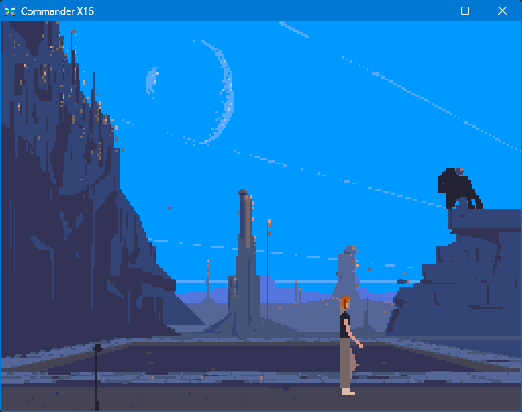

# Another World for the Commander X16



A port of the classic game Another World (Out of This World) to the Commander X16.

## Installation

1. Download the file `ANOTHER.PRG` from the [Releases](https://github.com/cosmicr/anotherX16/releases)

2. Copy the game files from the **MS-DOS version** of Another World the same directory as your `ANOTHER.PRG` program file.

The required files are:
  - `MEMLIST.BIN`
  - `BANK01`
  - `BANK02`
  - `BANK03`
  - `BANK04`
  - `BANK05`
  - `BANK06`
  - `BANK07`
  - `BANK08`
  - `BANK09`
  - `BANK0A`
  - `BANK0B`
  - `BANK0C`
  - `BANK0D`

The game files can be found at archive.org and various other places online.

## Starting the game

### Emulator

The easiest way to load the game is to run the game using the following command line:

```sh
    x16emu -run -prg -joy1 another.prg
```

The `-joy1` option tells the emulator to use a gamepad for joystick 1 input.

### Real Hardware

To run the game on real hardware, copy the `ANOTHER.PRG` file and all the required bank files to your SD Card.

Then, start the Commander X16, and at the BASIC prompt, type:

```BASIC
    LOAD"ANOTHER.PRG",8
    RUN
```

I haven't yet tested it on real hardware, so please let me know if you encounter any issues.

## Controls

The game can be played using either a keyboard or a gamepad.

| Action           | Keyboard Key      | Gamepad Button  |
|------------------|-------------------|-----------------|
| Move Left        | Left Arrow        | D-Pad Left      |
| Move Right       | Right Arrow       | D-Pad Right     |
| Move Up / Jump   | Up Arrow          | D-Pad Up        |
| Move Down / Crouch | Down Arrow      | D-Pad Down      |
| Action           | Z or Alt Key      | B Button        |
| Toggle Sound     | **S Key**         | —               |
| Enter Code       | **C Key**        | —               |

 - The toggle sound and code keys are the same as for the keyboard.
 - If the gamepad is not detected, the game will automatically fall back to keyboard controls.

## Building from Source

I built the game using CC65 with a custom batch makefile - you will need to have CC65 installed to build the game.

1. Install [CC65](https://cc65.github.io/cc65/)
2. Download or clone this repository

```sh
git clone https://github.com/cosmicr/anotherX16.git
```

3. Build process

### Windows

You can paste these into a command prompt or save them as a `.bat` file and run it.

```cmd
rem create directories
mkdir bin
mkdir bin\obj

rem assemble source files
ca65 --cpu 65c02 -t cx16 -I inc -g src\main.s -o bin\obj\main.o
ca65 --cpu 65c02 -t cx16 -I inc -g src\bank.s -o bin\obj\bank.o
ca65 --cpu 65c02 -t cx16 -I inc -g src\engine.s -o bin\obj\engine.o
ca65 --cpu 65c02 -t cx16 -I inc -g src\input.s -o bin\obj\input.o
ca65 --cpu 65c02 -t cx16 -I inc -g src\irq.s -o bin\obj\irq.o
ca65 --cpu 65c02 -t cx16 -I inc -g src\opcodes.s -o bin\obj\opcodes.o
ca65 --cpu 65c02 -t cx16 -I inc -g src\polygon.s -o bin\obj\polygon.o
ca65 --cpu 65c02 -t cx16 -I inc -g src\resource.s -o bin\obj\resource.o
ca65 --cpu 65c02 -t cx16 -I inc -g src\sample.s -o bin\obj\sample.o
ca65 --cpu 65c02 -t cx16 -I inc -g src\tasks.s -o bin\obj\tasks.o
ca65 --cpu 65c02 -t cx16 -I inc -g src\text.s -o bin\obj\text.o
ca65 --cpu 65c02 -t cx16 -I inc -g src\vera.s -o bin\obj\vera.o
ca65 --cpu 65c02 -t cx16 -I inc -g src\unpacker.s -o bin\obj\unpacker.o
ca65 --cpu 65c02 -t cx16 -I inc -g src\unpack.s -o bin\obj\unpack.o

rem link object files
ld65 -C cx16-asm.cfg -o bin\another.prg bin\obj\main.o bin\obj\bank.o bin\obj\engine.o bin\obj\input.o bin\obj\irq.o bin\obj\opcodes.o bin\obj\polygon.o bin\obj\resource.o bin\obj\sample.o bin\obj\tasks.o bin\obj\text.o bin\obj\vera.o bin\obj\unpacker.o bin\obj\unpack.o cx16.lib
```

### Linux / MacOS

I haven't tested the build process on Linux or MacOS, but it should be similar to Windows. You may need to adjust the paths and commands accordingly.

```bash
# create directories
mkdir -p bin/obj

# assemble source files (main first)
ca65 --cpu 65c02 -t cx16 -I inc -g src/main.s     -o bin/obj/main.o
ca65 --cpu 65c02 -t cx16 -I inc -g src/bank.s     -o bin/obj/bank.o
ca65 --cpu 65c02 -t cx16 -I inc -g src/engine.s   -o bin/obj/engine.o
ca65 --cpu 65c02 -t cx16 -I inc -g src/input.s    -o bin/obj/input.o
ca65 --cpu 65c02 -t cx16 -I inc -g src/irq.s      -o bin/obj/irq.o
ca65 --cpu 65c02 -t cx16 -I inc -g src/opcodes.s  -o bin/obj/opcodes.o
ca65 --cpu 65c02 -t cx16 -I inc -g src/polygon.s  -o bin/obj/polygon.o
ca65 --cpu 65c02 -t cx16 -I inc -g src/resource.s -o bin/obj/resource.o
ca65 --cpu 65c02 -t cx16 -I inc -g src/sample.s   -o bin/obj/sample.o
ca65 --cpu 65c02 -t cx16 -I inc -g src/tasks.s    -o bin/obj/tasks.o
ca65 --cpu 65c02 -t cx16 -I inc -g src/text.s     -o bin/obj/text.o
ca65 --cpu 65c02 -t cx16 -I inc -g src/vera.s     -o bin/obj/vera.o
ca65 --cpu 65c02 -t cx16 -I inc -g src/unpacker.s -o bin/obj/unpacker.o
ca65 --cpu 65c02 -t cx16 -I inc -g src/unpack.s   -o bin/obj/unpack.o 

# link object files
ld65 -C cx16-asm.cfg -o bin/another.prg \
  bin/obj/main.o bin/obj/bank.o bin/obj/engine.o bin/obj/input.o bin/obj/irq.o \
  bin/obj/opcodes.o bin/obj/polygon.o bin/obj/resource.o bin/obj/sample.o \
  bin/obj/tasks.o bin/obj/text.o bin/obj/vera.o bin/obj/unpacker.o bin/obj/unpack.o cx16.lib
```

## Known Issues

There are several known limitations and performance issues that affect gameplay:

### Performance Issues
- **Slow screen refresh rate**: The game currently runs at approximately 15-20 FPS instead of the target 30 FPS. The polygon rendering and page copying operations (`copy_page` takes ~136,032 cycles) consume significant CPU time per frame.
- **Frame rate inconsistency**: The main game loop uses `WAI` instructions for timing, but heavy rendering scenes can cause noticeable stuttering and frame drops.

### Audio Issues
- **Low quality sound**: Audio is limited to ~11kHz sample rate (down from the original's 22kHz) due to VERA PCM limitations and CPU constraints during audio mixing. Sound can be disabled with the "S" key to improve performance.
- **Crunchy/distorted audio**: The 4-channel audio mixing implementation uses simple bit-shifting for volume control, resulting in some artifacts and loss of dynamic range. Particularly noticeable on louder sounds such as the beast at the beginning of the game.
- **No music**: The music system is currently not implemented. Only sound effects are supported.

### Graphics Issues
- **Incorrect screen scrolling**: The vertical scrolling implementation (`copy_page_scroll`) has issues with boundary conditions and negative scroll values, causing visual glitches during camera movement. The gameplay is unaffected, but it is visually distracting.
- **Text rendering**: Due to the decreased resolution the text rendering is not as sharp as in the original. Some characters may appear slightly distorted.

### Missing Features
- **No music playback**: Background music tracks are not supported in this version.

These issues are primarily due to the Commander X16's hardware limitations and the complexity of porting the original's virtual machine architecture to 8-bit assembly language.

## Credits

The excellent original game was created by **Éric Chahi** and published by Delphine Software in 1991.

This port would not have been possible without the prior efforts of the following people:
 - [Gregory Montoir](https://github.com/cyxx) - Without his original reverse engineering work on the game, this port would not have been possible.
 - [Fabien Sanglard](https://fabiensanglard.net/) - His write ups on the game inspired me to take on this project.
 - Daniel Morais - Author of the MS-DOS port
 - [César Botana](https://malandrin.github.io/) - Wrote a brilliant Rust implementation that runs in the browser.
 - [Sylvain Lefebvre](https://github.com/sylefeb) - Helped me finally understand how the polygon vertices ordering worked.

This Repository Copyright (C) 2025 Rainer DeTemple
Licensed under the GNU GPL v3. See LICENSE for details.

## Disclaimer

This is an unofficial, fan-made port of Another World (original © Delphine Software International, 1991).
It is provided for educational and preservation purposes only.
No original assets (graphics, audio, or data) are included or distributed.
“Another World” and all related intellectual property remain the property of their respective owners.

Source code is released under the GNU General Public License v3.0 (GPLv3).